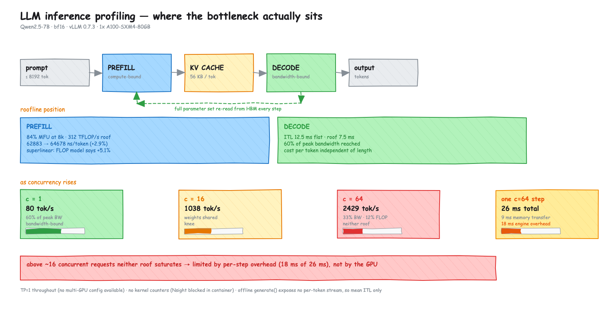
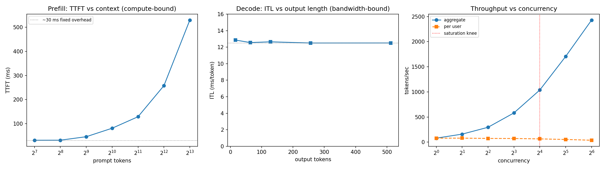
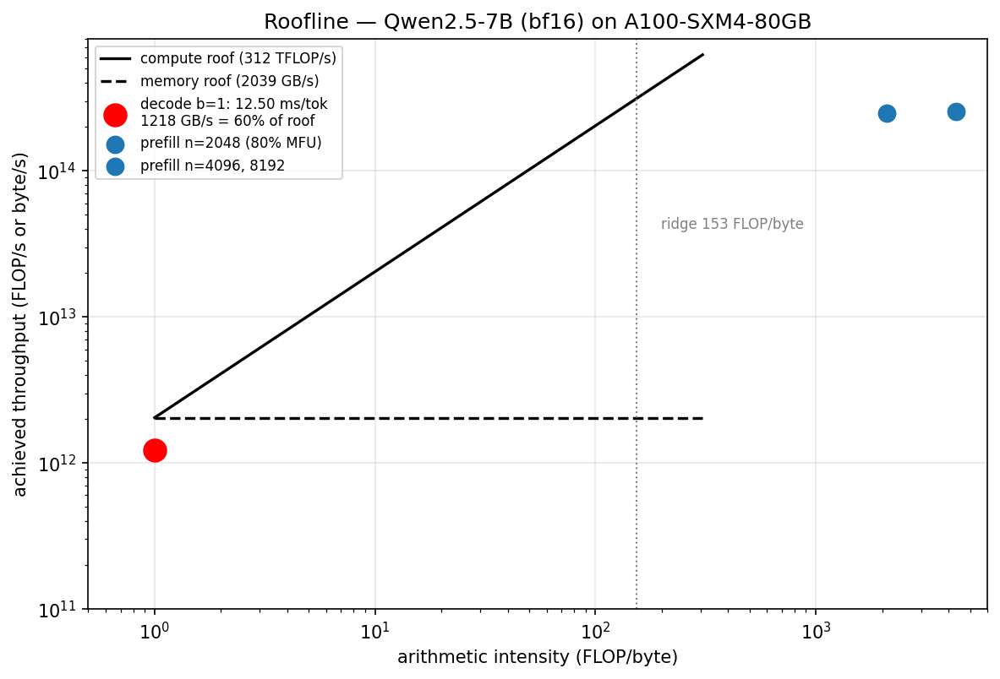

# LLM Inference Profiling: Qwen2.5-7B on A100-SXM4-80GB

[](LICENSE)
[](https://github.com/vllm-project/vllm)
[](https://pytorch.org)
[](https://www.nvidia.com/en-us/data-center/a100/)

A measurement study of what actually constrains LLM serving throughput. Rather than reporting latency numbers in isolation, this work decomposes a serving workload into its two constituent phases, characterises each against a hardware roofline derived from the model's architecture, and identifies where the bottleneck moves as concurrency rises.

**Headline result:** prefill is compute-bound and already runs at 80–84% of the A100's dense bf16 ceiling — there is little headroom left. Decode is bandwidth-bound, achieving 60% of peak HBM throughput with a per-token cost that is invariant to sequence length. Above roughly 16 concurrent requests, neither roof is saturated and throughput becomes limited by per-step engine overhead rather than by the GPU.

**Author:** [Yuvraj Singh Bhadoria](https://github.com/YuvrajSinghBhadoria2) · **Repository:** [`vllm-inference-profiling`](https://github.com/YuvrajSinghBhadoria2/vllm-inference-profiling)

## Key Findings

| | Measurement | Against hardware limit |
|---|---|---|
| **Prefill** | 84% MFU at 8k context | 312 TFLOP/s compute roof — **little headroom left** |
| **Prefill scaling** | 62,883 → 64,677 ns/token (+2.9%) for 2× context | FLOP model predicts +5.1%; measurement is lower |
| **Decode** | ITL flat at 12.50 ms, 16→512 output tokens | 7.50 ms memory roof — **60% of peak achieved** |
| **Throughput** | 79.6 → 2429 tok/s as concurrency 1→64 | Near-linear to c≈16, then saturating |
| **c = 64** | bandwidth 33%, compute 12% | **Neither roof saturated** — 18 of 26 ms per step is overhead |

The last row is the substantive result. The conventional expectation is that decode throughput stays memory-bound at high concurrency; at c=64 it does not.

## Test Configuration

| Component | Specification |
|---|---|
| Model | Qwen2.5-7B-Instruct — 7.615B parameters, bf16, 14.25 GiB resident weights |
| Accelerator | 1× NVIDIA A100-SXM4-80GB (sm80) — 2039 GB/s HBM2e, 312 TFLOP/s dense bf16 |
| Serving engine | vLLM 0.7.3, PyTorch 2.5.1+cu124 |
| Parallelism | Tensor parallel degree 1, `enforce_eager=True`, seed 1234 |
| Model context | 8192 tokens maximum |
| KV cache | 1,038,128 tokens (126× concurrency at full context length) |
| KV footprint | 56 KB/token — 4 KV heads × 128 dim × 28 layers × 2 (K,V) × 2 bytes |

## Analytical Framework

Autoregressive transformer inference comprises two structurally distinct workloads. Treating them as a single measurement obscures the governing hardware constraint in each, so they were characterised independently.

**Prefill** evaluates the full prompt as one parallel batch of *n* tokens. Each model weight is fetched from HBM once and reused across all *n* token positions, giving an arithmetic intensity that scales with sequence length (~520 FLOP/byte at n=512, ~10217 at n=8192). This is a GEMM-dominated regime; the workload is compute-bound.

**Decode** produces one token per step. The autoregressive dependency — each output token conditions on all preceding tokens — prevents batching *within* a sequence, so the full parameter set is re-read from HBM for every token generated and used for a single multiply-accumulate. Arithmetic intensity is ~1 FLOP/byte, roughly 150× below the device's ridge point of 153 FLOP/byte. This is a GEMV-dominated regime; the workload is bandwidth-bound.

Predicted throughput ceilings follow directly from these intensities:

- **Prefill**: `2·P·n` FLOPs at 312 TFLOP/s
- **Decode**: `2·P` bytes at 2039 GB/s, where `P` = 7.615e9 parameters

## Results

### 1. Prefill: compute-bound and near the hardware ceiling

| Context (tokens) | TTFT (ms) | ns/token | Attention share of FLOPs | MFU |
|---:|---:|---:|---:|---:|
| 128 | 30.9 | 241,269 | 0.2% | 20% |
| 512 | 45.6 | 88,973 | 0.7% | 55% |
| 1024 | 80.8 | 78,923 | 1.3% | 63% |
| 2048 | 128.6 | 62,787 | 2.6% | 80% |
| 4096 | 257.6 | 62,883 | 5.1% | 82% |
| 8192 | 529.8 | 64,677 | 9.7% | 84% |

**Latency grows superlinearly with context.** Marginal cost per token is flat at ~62.8 ns between n=2048 and n=4096, then rises to 64.7 ns at n=8192 — approximately **+2.9%** for a 2× context increase. The cause is the quadratic attention term, whose share of total FLOPs grows from 5.1% to 9.7% across the same interval.

This contradicts the common assumption that prefill latency scales linearly with prompt length. Below a few thousand tokens the linear GEMM term dominates and the approximation holds; beyond that the O(n²) attention term breaks it.

**The FLOP model over-predicts the deviation.** Total FLOPs rise by a factor of 2.10 across the same interval, which predicts **+5.1%** over linear scaling against **+2.9%** observed. The discrepancy is expected rather than anomalous: the model computes FLOPs per token from the full context length, whereas the measurement is a wall-clock ratio between two points, and a fixed per-request overhead of roughly 30 ms (visible as the flat region at n=128–256) is amortised over twice as many tokens at n=8192, diluting the measured marginal cost. The qualitative conclusion holds — prefill is measurably superlinear — but the magnitude is smaller than a naive FLOP ratio suggests, and this report does not claim otherwise.

**Model FLOPs utilisation reaches 80–84%** at n≥2048. Prefill is therefore not simply compute-bound but is executing close to the device's dense bf16 throughput limit. Remaining gains would require kernel fusion or reduced precision rather than better scheduling — an important result for capacity planning, since it indicates prefill throughput is close to irreducible on this hardware.

The ~30 ms floor observed at n=128–256 is fixed engine overhead — request admission and initial kernel launch latency — independent of prompt content.

### 2. Decode: bandwidth-bound at 60% of peak throughput

| Output (tokens) | ITL (ms) | Throughput, batch 1 (tok/s) |
|---:|---:|---:|
| 16 | 12.86 | 77.8 |
| 64 | 12.55 | 79.7 |
| 128 | 12.64 | 79.1 |
| 256 | 12.50 | 80.0 |
| 512 | 12.50 | 80.0 |

**Inter-token latency is invariant to output length** — constant at 12.5 ms across a 32× range. Per-token cost does not increase as the sequence grows, confirming that the weight read dominates and KV cache traffic is a small perturbation by comparison.

Measured against the roofline:

```
Weights resident          14.25 GiB
Device bandwidth          2039 GB/s
Theoretical ITL ceiling      7.50 ms   ->  133 tok/s
Measured ITL (batch 1)      12.50 ms   ->   80 tok/s
Achieved bandwidth                        60% of peak
```

The residual 40% is attributable to attention reads, normalisation and activation kernels, sampling overhead, and inter-kernel launch gaps — all of which consume time without streaming weights. Achieving 60% of theoretical peak on a live serving engine is a realistic figure and establishes the baseline any decode-path optimisation would need to beat.

### 3. Throughput under concurrency: batching is near-free, then it is not

| Concurrency | Aggregate (tok/s) | Per-user (tok/s) | Marginal gain |
|---:|---:|---:|---:|
| 1 | 79.6 | 79.6 | — |
| 2 | 159.6 | 79.8 | 2.01× |
| 4 | 295.8 | 74.0 | 1.85× |
| 8 | 581.7 | 72.7 | 1.97× |
| 16 | 1037.6 | 64.8 | 1.78× |
| 32 | 1706.2 | 53.3 | 1.64× |
| 64 | 2429.4 | 38.0 | 1.42× |

**Per-user throughput is effectively unchanged between c=1 and c=2** (79.6 → 79.8 tok/s). Model weights are read from HBM once per decode step regardless of how many sequences are resident, so admitting a second concurrent request costs almost no additional memory traffic. This is the mechanism behind PagedAttention and continuous batching, and it explains why aggregate throughput scales near-linearly through c=16.

**Above c≈16 the scaling curve bends.** Marginal efficiency degrades monotonically — 1.78× → 1.64× → 1.42× — establishing the saturation knee at approximately 16 concurrent requests on this configuration.

### 4. The bottleneck shifts from memory to overhead

This is the substantive finding. The conventional expectation is that decode throughput remains memory-bandwidth-bound at high concurrency. Testing that directly at c=64:

```
Decode steps                          38 /s
Weights per step                   15.3 GB
KV reads per step                    2.4 GB   (64 seq × ~640 tok × 56 KB)
Aggregate bandwidth                 670 GB/s  =  33% of peak
Aggregate compute                    37 TFLOP/s =  12% of peak
```

**Neither roofline is approached.** Were decode still bandwidth-bound at 64 concurrent users, measured bandwidth would sit near 100%; it sits at a third. Compute utilisation of 12% confirms the workload is not compute-limited either. Each decode step takes 26.3 ms, of which memory transfer accounts for only 8.7 ms — the remaining ~17.6 ms is kernel launch latency, Python-side scheduling in the vLLM engine loop, and synchronisation gaps between layers.

The arithmetic intensity at c=64 (approximately 55 FLOP/byte) does place the workload nominally below the ridge point, but arithmetic intensity classifies a workload's *regime*; it does not establish saturation. Bandwidth utilisation is the operative diagnostic, and it shows the device is not memory-starved at high concurrency.

The implication for optimisation is direct: the available headroom at c=64 lies in reducing per-step overhead — CUDA graph capture (disabled here via `enforce_eager=True` specifically to expose this ceiling), the vLLM V1 engine, or kernel fusion — not in additional memory capacity, larger KV cache, or faster interconnect.

This also explains why the 126× KV cache headroom is not the binding constraint. **Memory capacity and memory bandwidth are distinct limits**, and at c=64 neither constrains throughput.

## Diagrams







The block diagram is generated by `make_arch.py`, which reads the CSVs and asserts every figure before emitting it — if the data changes, the diagram fails rather than silently going stale. Editable source: [`architecture.excalidraw`](architecture.excalidraw) (open at [excalidraw.com](https://excalidraw.com)).

## Limitations

Stated explicitly, as they bound the conclusions above.

**Tensor parallelism is untested.** All multi-GPU configurations on the available provider were unavailable, so every measurement is TP=1 on a single device. The question of where weight sharding begins to repay its all-reduce cost — typically at low batch sizes, where TP may lose to TP=1 on interconnect-bound hardware — remains open.

**The overhead conclusion in §4 is inferred, not directly observed.** Nsight Compute could not execute in the container environment (no CUDA toolkit present for the profiler binary). The finding derives from aggregate throughput combined with the roofline model, rather than from a kernel timeline showing idle gaps directly. This is the weakest evidentiary link in this report and the first item to address with additional access.

**Percentile latency is not reported.** vLLM's offline `generate()` interface returns a single final result per prompt, providing no per-token output stream from which to compute P50/P99. Only mean inter-token latency is reported here. Genuine tail percentiles require an OpenAI-compatible server with streaming responses.

**Context length is capped at 8192 tokens**, so prefill superlinearity was characterised across a single context doubling. The FLOP model predicts continued divergence beyond 16k tokens; this remains unverified. Note also that the model over-predicts measured superlinearity by roughly 2× (§1), so it should be treated as an upper bound rather than a precise predictor.

**Single-run sampling.** Each configuration was measured once and run-to-run variance was not characterised. The +2.9% superlinearity figure in §1 is therefore close to the noise floor, and its magnitude should not be relied upon; the qualitative departure from linear scaling is the robust result.

## Reproduction

```bash
git clone https://github.com/YuvrajSinghBhadoria2/vllm-inference-profiling.git
cd vllm-inference-profiling
pip install -r requirements.txt
python bench.py --out results
```

Version pins are required for reproducibility. vLLM ≥ 0.8 depends on PyTorch ≥ 2.10, which requires NVIDIA driver ≥ 580; this study ran on driver 550.54.14 / CUDA 12.4. On newer driver versions the pins may be relaxed.

**Methodological notes on the measurement harness:**

- **`enforce_eager=True`** disables CUDA graph capture. This reduces absolute throughput but ensures latency reflects genuine kernel execution rather than graph replay, which is necessary for a benchmark intended to attribute cost to hardware behaviour.
- **Token-exact prompt construction.** Prompts are supplied as explicit token IDs (`TokensPrompt`) rather than repeated strings, since repeated text does not tokenise to the intended length.
- **Distinct prompts per concurrency slot.** Identical prompts would be served from vLLM's prefix cache, measuring cache behaviour rather than scheduling behaviour.
- **`ignore_eos=True`** guarantees the requested output length is generated exactly.
- **KV capacity read from the live engine** rather than estimated analytically.

TTFT and ITL are obtained by subtraction: one generation call requesting a single token measures prefill in isolation, a second requesting N tokens measures prefill plus decode. The identical prompt in both calls causes the prefill component to cancel, leaving the decode phase.

## Artifacts

| File | Contents |
|---|---|
| `bench.py` | Standalone benchmark harness |
| `benchmark.ipynb` | Notebook version with per-section methodology notes |
| `prefill.csv` | TTFT vs context length, with derived intensity, attention share, MFU, ns/token |
| `decode.csv` | ITL and throughput versus generation length |
| `throughput.csv` | Aggregate and per-user throughput vs concurrency, with marginal gain |
| `figures.png` | Prefill latency, decode latency, and throughput summary |
| `roofline.png` | Roofline with measured operating points |
| `architecture.png` / `.svg` | Block diagram of phases, roofline position, concurrency behaviour |
| `architecture.excalidraw` | Editable source for the diagram (open at excalidraw.com) |
| `make_arch.py` | Diagram generator — reads the CSVs, asserts every figure it draws |
| `LICENSE` | MIT |